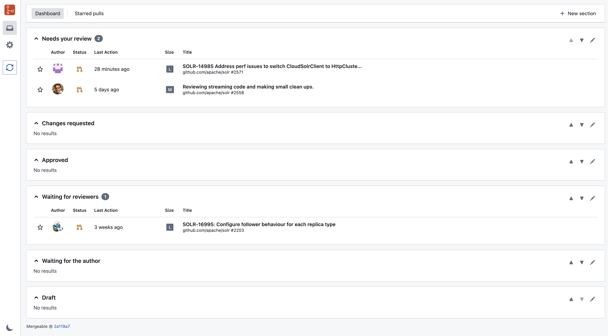

# Mergeable

Mergeable is an inbox for GitHub pull requests.

This project is an attempt at being better than GitHub when providing an overview of open pull requests needing my attention.
Indeed, the "[Pull Requests](https://github.com/pulls)" page is not customisable at all.
It comes with four tabs associated with pre-defined search queries, that we cannot change.
Tabs are also inconvenient, as they requiring switching from one to another to see pull requests of interest.

Mergeable fills this gap by providing a single dashboard showing all pull requests one is interesting in at a glance.
It even allows to track pull requests associated with different accounts and/or several instances of GitHub (e.g., GitHub Enterprise).



## Features

Mergeable provides the following features:
* Fully customisable sections.
* Any number of GitHub instances can be connected (e.g., GitHub Enterprise).
* Number of pending pull requests is shown in the page's title.
* Local only, data is stored in your browser's storage.
* Command bar (cmd+k), allowing to quickly navigate to a given pull request by its title.
* Dark mode.

You can use the demo instance hosted at [mergeable.pages.dev](https://mergeable.pages.dev/), or run your own instance.

## Run locally

This project is a simple SPA, built using [PnPM](https://pnpm.io), [Turborepo](https://turbo.build/repo) and [Vite](https://vitejs.dev/).
It can be started locally with the following command:

```bash
pnpm dev
```

# Self-host

This project is designed from the beginning to be easy to self-host.

## Docker

A Docker image is continuously published at every commit to the main branch.
It can be started with the following command:

```bash
docker run -p 8080:80 ghcr.io/pvcnt/mergeable
```

## Helm Chart

A Helm Chart is continuously published at every commit to the main branch.
It can be deployed to a Kubernetes cluster with the following command:

```bash
helm install mergeable oci://ghcr.io/pvcnt/helm/mergeable
```

## Custom build

If you need further customisation you may need to build this project by yourself, with the following command:

```bash
pnpm build
```

The following environment variables may be defined to customise the build:

| Variable name | Description | Example |
|---------------|-------------|---------|
| VITE_COMMIT_SHA | sha1 of the commit from which the app has been built. Displayed in the footer. | `4584210` |
| VITE_GITHUB_URLS | Comma-separated list of allowed GitHub base URLs. When configured, a dropdown will be displayed instead of a text input when creating a new connection. | `https://api.github.com,https://git.mycompany.com/api/v3` |

This will create a standard SPA website under the `apps/web/dist` directory.
It can then be deployed to any Web server able to serve static content, e.g., [Cloudflare Pages](https://developers.cloudflare.com/pages/framework-guides/deploy-a-vite3-project/) or [Netlify](https://docs.netlify.com/integrations/frameworks/vite/).
The only required configuration is that all traffic directed to a path that does not match an existing file should be redirected to `index.html`.

## Docker

A Dockerfile is provided that runs a simple nginx server serving the static content.